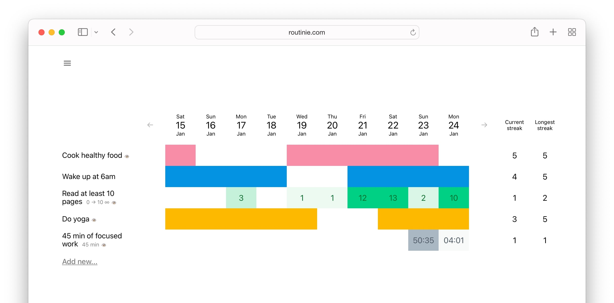

# Routinie: a simple solution to help you stay efficient and productive

Routinie is a simple yet efficient habit tracker that allows you to make sure you progress towards your goals. 
It includes trackers and timers, streaks and public pages, and is packed with features that allow you to efficiently work on improving yourself.

This repository contains the frontend for Routinie. There is also [the backend counterpart](http://github.com/alwx/routinie-backend).
Routinie [was originally launched](https://www.producthunt.com/products/routinie) as a commercial product. However, it was not successful and I decided to publish its sources.

## Why the sources can be interesting?

1. It's a nice example of a TypeScript app that works with a backend and uses [Redux Toolkit](https://redux-toolkit.js.org) (which still seems to be not very popular and commonly used in 2022).
1. I am personally proud of my custom component for context menu which does proper position and allows deep customization.
1. The code for trackers and tracker events (including streak detection, "fulfillment" and all the related concepts) is also pretty nice. This code is also covered by tests (check `tests/utils/trackers.test.ts`).

## Development

It's a regular TypeScript project that uses Yarn. Just set the env variables (`.env` contains the defaults but you might want to update some Stripe variables) and do `yarn install` and `yarn run`.

## Production

Run `make build-frontend` to build the frontend. Make sure all the required variables are set in `.env.production`.

## License

[MIT License](./LICENSE.txt)
